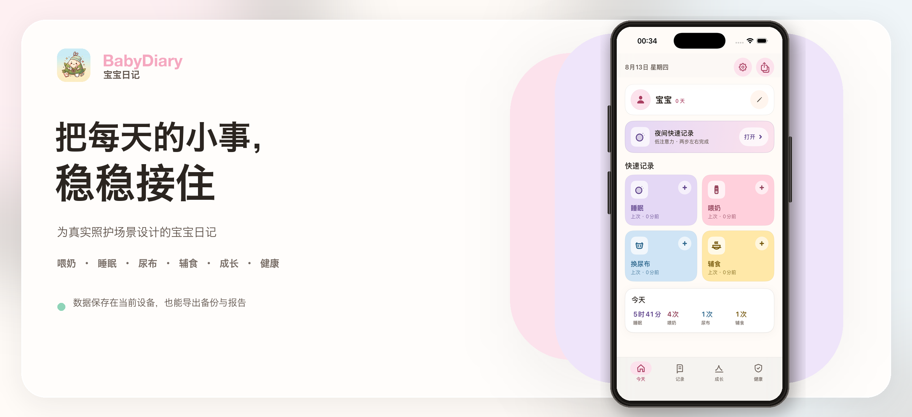
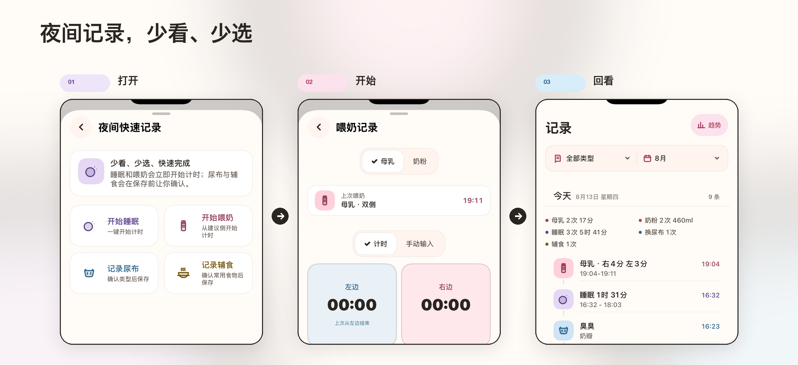
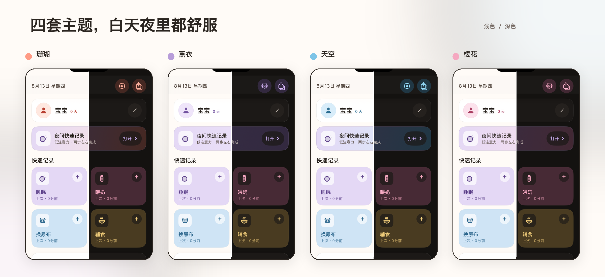
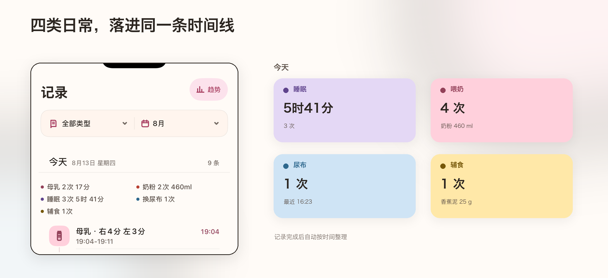
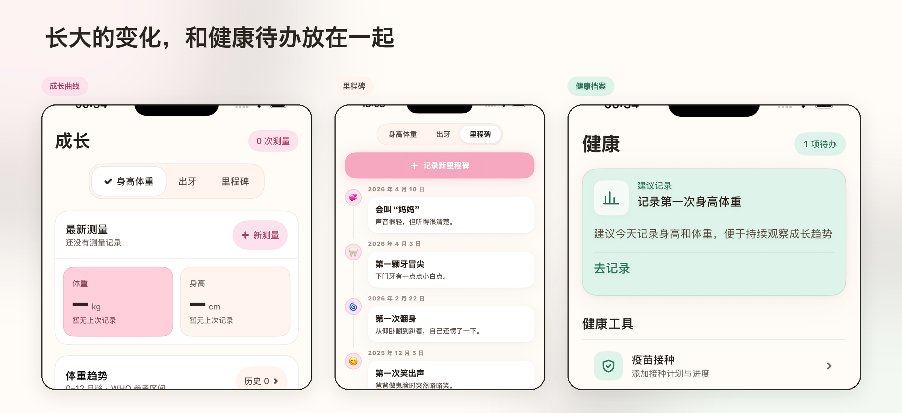

<a id="readme-zh"></a>

<div align="center">

# BabyDiary 宝宝日记

[简体中文](#readme-zh) · [English](#readme-en)

一款轻量、温暖、本地优先的 iOS 宝宝照护记录 App。

快速记下喂奶、睡眠、尿布与辅食，也把成长、疫苗、用药和过敏观察整理在一起。

`iOS 18+` · `SwiftUI` · `中文优先` · `本地存储`

</div>



## 2026 年 8 月大版本更新

这次更新重新整理了 BabyDiary 的信息层级、记录流程和夜间体验，重点是让照护者更快看懂当前状态、用更少步骤完成记录，并降低误删或丢失进行中记录的风险。

- **状态优先的新界面**：重做首页、记录、成长与健康等核心页面，正在进行的睡眠或喂奶会优先显示。
- **夜间快速记录**：为低注意力场景提供睡眠、喂奶、尿布和辅食的快捷入口，并自动带入最近使用的选项。
- **更可靠的记录流程**：统一保存状态、错误与成功反馈；退出未保存表单前确认；删除后支持立即撤销。
- **更灵活的提醒**：喂养提醒支持固定间隔或作息表，哄睡提醒支持清醒时长或固定时间，两者都支持夜间免打扰。
- **健康待办更集中**：按优先级汇总疫苗、用药和食物观察事项，让需要处理的内容先出现。
- **完整外观系统**：珊瑚、薰衣、天空、樱花四套主题适配浅色、深色和跟随系统模式。
- **无障碍与设备适配**：完善 VoiceOver、动态字体、减弱动态效果、横屏，以及不同尺寸 iPhone 的布局表现。





## 设计出发点

照顾宝宝时，很少有完整的时间填写复杂表单。BabyDiary 更关注三个真实场景：

- **现在发生了什么**：正在进行的睡眠和喂奶始终清楚可见。
- **刚刚发生过什么**：快速回看上次喂奶、睡眠、尿布或辅食。
- **重要信息在哪里**：成长与健康记录集中保存，需要时随时查找和导出。

界面保持轻、暖、清楚；记录流程尽量少打断，夜间也能用更少操作完成记录。

## 核心功能

- **日常记录**：喂奶、睡眠、尿布、辅食，支持计时、手动补记、编辑与撤销删除。
- **夜间模式**：为低注意力场景设计的快速入口，可一键开始或继续记录。
- **成长档案**：身高、体重、头围、成长曲线、出牙与里程碑。
- **健康管理**：疫苗计划、用药记录、食物排敏与待办提醒。
- **系统能力**：Widget、Live Activity、喂养与哄睡提醒、快捷指令和深链接。
- **外观与无障碍**：四套主题、深浅色模式、动态字体、VoiceOver 与减弱动态效果。
- **备份与报告**：本地自动保存，支持 JSON 备份恢复和 PDF 报告导出。





## 数据与隐私

BabyDiary 是本地优先的单机 App：

- 数据保存在当前设备的 App 本地空间。
- 不包含账号、服务器上传或多人实时同步。
- JSON 用于完整备份与恢复；PDF 用于阅读和分享。
- 导入 JSON 会覆盖当前数据，操作前请先保留现有备份。

> BabyDiary 只用于日常记录，不提供医疗诊断或治疗建议。疫苗、用药和过敏相关判断请咨询专业医生。

## 快速开始

需要 macOS、Xcode 16+、iOS 18 模拟器，以及 [XcodeGen](https://github.com/yonaskolb/XcodeGen)。

```bash
git clone https://github.com/Evina-Huang/BabyDiary.git
cd BabyDiary
brew install xcodegen
xcodegen generate
open BabyDiary.xcodeproj
```

在 Xcode 中选择 `BabyDiary` scheme 后运行。真机调试时，请将签名 Team 改为自己的 Apple Developer Team。

### 命令行构建与测试

```bash
# Build
xcodebuild -project BabyDiary.xcodeproj -scheme BabyDiary \
  -destination 'platform=iOS Simulator,name=iPhone 17' build

# Test
xcodebuild -project BabyDiary.xcodeproj -scheme BabyDiary \
  -destination 'platform=iOS Simulator,name=iPhone 17' test
```

测试使用 Swift Testing（`@Test` / `#expect`）。

## 技术概览

- SwiftUI + Observation
- WidgetKit + ActivityKit + AppIntents
- Charts
- Codable JSON + UIKit PDF rendering
- Swift Testing
- XcodeGen

```text
BabyDiary/
├── BabyDiary/Sources/       # App、模型、组件与页面
├── BabyDiary/Resources/     # 图标、声音与配置
├── BabyDiaryWidgets/        # Widget 与 Live Activity
├── BabyDiaryTests/          # Swift Testing 测试
└── project.yml              # XcodeGen 工程配置源
```

项目以单一 `@Observable AppStore` 驱动界面。`BabyDiary.xcodeproj` 由 `project.yml` 生成；修改 target、资源或源码结构后，请重新运行 `xcodegen generate`。

## 当前边界

- 仅支持 iOS 18+，界面以中文为主。
- 暂无 iCloud、账号系统、家庭成员实时同步、Android 或 Web 版本。
- PDF 报告用于阅读与分享，不是正式医疗文书。

---

<a id="readme-en"></a>

# BabyDiary (English)

[简体中文](#readme-zh) · [English](#readme-en)

A lightweight, warm, and local-first baby-care journal for iOS.

Quickly log feeding, sleep, diapers, and solids while keeping growth, vaccinations, medication, and food observations together in one place.

`iOS 18+` · `SwiftUI` · `Chinese-first UI` · `Local storage`

## August 2026 Major Update

This release reorganizes BabyDiary's information hierarchy, logging flows, and nighttime experience. The goal is to make active care easier to understand, reduce the steps needed to save a record, and protect in-progress or recently deleted data.

- **A status-first interface:** Home, Records, Growth, and Health were redesigned so active sleep or feeding sessions stay visible.
- **Night Quick Record:** A low-attention flow for sleep, feeding, diapers, and solids that reuses recent choices when helpful.
- **Safer logging:** Consistent save states, error and success feedback, confirmation before discarding changes, and immediate undo after deletion.
- **Flexible reminders:** Feeding supports interval or schedule-based reminders; sleep supports awake-duration or fixed-time reminders. Both include quiet hours.
- **Focused health tasks:** Vaccinations, medication, and food observations are collected and ordered by priority.
- **A complete appearance system:** Coral, Lavender, Sky, and Blossom themes support light, dark, and system appearance modes.
- **Accessibility and device support:** Improved VoiceOver, Dynamic Type, Reduce Motion, landscape layouts, and adaptation across iPhone sizes.

## Design Principles

Caring for a baby rarely leaves time for a complex form. BabyDiary is built around three everyday questions:

- **What is happening now?** Active sleep and feeding sessions remain easy to find.
- **What happened recently?** The latest feeding, sleep, diaper, or solid-food record is always close at hand.
- **Where is the important information?** Growth and health records stay organized, easy to review, and ready to export.

The interface is intentionally light, warm, and clear. Logging should interrupt care as little as possible, especially at night.

## Core Features

- **Daily care logging:** Feeding, sleep, diapers, and solids with timers, manual entries, editing, and undo deletion.
- **Night mode:** A low-attention shortcut for starting or continuing common records.
- **Growth journal:** Height, weight, head circumference, growth charts, teeth, and milestones.
- **Health tracking:** Vaccination plans, medication records, food introduction, allergy observations, and prioritized tasks.
- **System integrations:** Widgets, Live Activities, feeding and sleep reminders, App Shortcuts, and deep links.
- **Appearance and accessibility:** Four themes, light and dark modes, Dynamic Type, VoiceOver, and Reduce Motion support.
- **Backup and reports:** Automatic local saving, JSON backup and restore, and PDF report export.

## Data and Privacy

BabyDiary is a local-first, single-device app:

- Data is stored in the app's local space on the current device.
- There is no account system, server upload, or real-time family sync.
- JSON is intended for complete backup and restore; PDF is intended for reading and sharing.
- Importing a JSON backup replaces the current data, so keep a copy of existing records first.

> BabyDiary is a record-keeping tool, not a source of medical diagnosis or treatment advice. Consult a qualified healthcare professional about vaccinations, medication, or allergic reactions.

## Getting Started

You will need macOS, Xcode 16 or later, an iOS 18 simulator, and [XcodeGen](https://github.com/yonaskolb/XcodeGen).

```bash
git clone https://github.com/Evina-Huang/BabyDiary.git
cd BabyDiary
brew install xcodegen
xcodegen generate
open BabyDiary.xcodeproj
```

Select the `BabyDiary` scheme in Xcode and run it. For a physical device, replace the signing Team with your own Apple Developer Team.

### Build and Test from the Command Line

```bash
# Build
xcodebuild -project BabyDiary.xcodeproj -scheme BabyDiary \
  -destination 'platform=iOS Simulator,name=iPhone 17' build

# Test
xcodebuild -project BabyDiary.xcodeproj -scheme BabyDiary \
  -destination 'platform=iOS Simulator,name=iPhone 17' test
```

Tests use Swift Testing (`@Test` / `#expect`).

## Technical Overview

- SwiftUI + Observation
- WidgetKit + ActivityKit + AppIntents
- Charts
- Codable JSON + UIKit PDF rendering
- Swift Testing
- XcodeGen

```text
BabyDiary/
├── BabyDiary/Sources/       # App, models, components, and screens
├── BabyDiary/Resources/     # Icons, sounds, and configuration
├── BabyDiaryWidgets/        # Widgets and Live Activities
├── BabyDiaryTests/          # Swift Testing test suite
└── project.yml              # Source of truth for XcodeGen
```

The app is driven by a single `@Observable AppStore`. `BabyDiary.xcodeproj` is generated from `project.yml`; rerun `xcodegen generate` after changing targets, resources, or the source layout.

## Current Scope

- iOS 18+ only, with a Chinese-first interface.
- No iCloud, account system, real-time family sharing, Android app, or web app yet.
- PDF exports are readable reports, not official medical documents.
